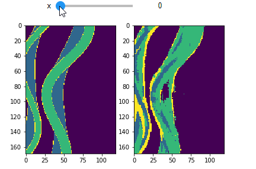

# CNN Facies Classifier
*Trabalho de Conclusão de Curso de Ciências da Computação na UFSC*

## Sobre



## Setup
```
pip install -r requirements.txt
```

### Stanford VI-E
```
python src/data/make_dataset.py
```

### F3-Block
Os dados do bloco F3 utilizados neste trabalho estão disponpíveis [aqui](https://github.com/olivesgatech/facies_classification_benchmark).
````python src/data/make_dataset_f3.py```